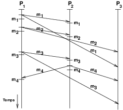

##### Shihui Huang et Bastien Sun

---

### Algorithme de diffusion causale à base de vecteurs d'horloge de Birman et Joseph, 1987

Motivations et objectifs&nbsp;:

- l'ossature de l'application de tchat réalise déjà une diffusion fiable, sous hypothèse d'absence de défaillance de processus ou de connexion. Nous ajoutons la propriété de causalité&nbsp;;
- cet exercice de mise en œuvre permet d'étudier le concept de vecteurs d'horloge, qui est un concept très utilisé en algorithmique répartie&nbsp;;
- dans la question discutant de la mise en œuvre du respect de cette propriété d'ordre de la diffusion soit par les serveurs soit par les clients, cet exercice permet de discuter d'un principe important des systèmes répartis : l'argument dit de « bout en bout », en anglais «&nbsp;*the end-to-end argument*&nbsp;»&nbsp;:
    - J.H. Saltzer, D.P. Reed, and D.D. Clark, [*End-to-end arguments in system design*](http://web.mit.edu/Saltzer/www/publications/endtoend/endtoend.pdf"), ACM Transactions on Computer Systems, 2(4):277–288, November 1984&nbsp;: «&nbsp;*The function in question can completely and correctly be implemented only with the knowledge and help of the application standing at the end points of the communication system. Therefore, providing that questioned function as a feature of the communication system itself is not possible. (Sometimes an incomplete version of the function provided by the communication system may be useful as a performance enhancement.*&nbsp;»

Dans cette étape, nous mettons en œuvre l'algorithme de diffusion causale de [Birman et Joseph, 1987](https://www-inf.telecom-sudparis.eu/COURS/AlgoRep/Web/6.11.14.html") du cours d'algorithmique répartie.

Pour ne pas rendre la solution trop complexe, nous formulons les hypothèses suivantes pour cette étape&nbsp;:

- aucun message n'est perdu, c'est-à-dire les liens entre processus sont fiables. Cette hypothèse est réaliste car nous utilisons TCP&nbsp;;
- aucun processus ne défaille. Cette hypothèse simplificatrice permet de réaliser une solution dans une durée de développement raisonnable&nbsp;: nous n'ajoutons pas de mécanisme de retransmission des messages suite aux défaillance et recouvrement de processus ou lien&nbsp;;
- les clients ne diffusent pas de messages avant que tous les serveurs et tous les clients ne soient démarrés, et avant que toutes les connexions ne soient ouvertes. Cette hypothèse signifie que tous les messages sont diffusés à tous les clients.

Répondre aux questions qui suivent doit vous aider à mettre en œuvre et à tester l'algorithme. Vos éléments de réponse constituent le compte rendu du TP.

#### 1. Mise en œuvre de l'algorithme

##### 1.a Est-ce un algorithme à insérer dans le client ou dans le serveur&nbsp&nbsp;? Les serveurs interprètent-ils le contenu des messages&nbsp;? gèrent-ils l'ordre de livraison des messages&nbsp;?

- Est-ce un algorithme à insérer dans le client ou dans le serveur?
    - Dans le client.
- Les serveurs interprètent-ils le contenu des messages?
    - Non.
- gèrent-ils l'ordre de livraison des messages?
    - Oui.
    
##### 1.b Nous vous proposons la classe `chat.common.VectorClock`. Étudiez cette classe à travers les commentaires Javadoc ainsi que les tests unitaires programmés dans la classe `chat.VectorClockTest`.

##### 1.c Lorsque vous ajoutez un algorithme, faites en sorte que cet algorithme ait son propre journal (*logger*).

##### 1.d À quoi correspond la ligne&nbsp;5 de l'algorithme&nbsp;? Qu'en fait-on&nbsp;?

- À quoi correspond la ligne&nbsp;5 de l'algorithme&nbsp;?
    - `deliver(C,m)` livre le message m à l'application dans l'ordre causal.
- Qu'en fait-on&nbsp;?
    - réception d'un message de tchat par le client.

##### 1.e Selon les lignes&nbsp;7, 11 et&nbsp;13 de l'algorithme, à quoi correspondent les valeurs «&nbsp;`forall k != p, v_p[k]`&nbsp;» du vecteur `v_p`&nbsp;?

- les valeurs du vecteur `v_p` correspondent aux horloges scalaire du prochain message attendu par `p`en provenance de `k`.

##### 1.f À quoi correspond l'expression « `(v_p[k] >= v_s[k])` » de la ligne 11 de l'algorithme&nbsp;?

- la condition `∀k, v_p[k] ≥ v_s[k]` signifie que le processus `p` attend le `vp[0]`è message de `p0` ou le `vp[1]`è message de `p1` ou le `vp[2]`è message de `p2`, etc.

##### 1.g Dans le code, où proposez-vous d'insérer, d'écrire et de lire les vecteurs d'horloge&nbsp;?

- dans les classes ChatMsgContent et Client

##### 1.h Quelles sont les structures de données de l'algorithme&nbsp;? Où proposez-vous de les insérer&nbsp;?

- Quelles sont les structures de données de l'algorithme&nbsp;?
    - HashSet pour la variable `msgBag
- Où proposez-vous de les insérer&nbsp;?
    - dans la classe Client

##### 1.i Dans le code, où proposez-vous d'insérer les lignes&nbsp;4—7 de l'algorithme&nbsp;?

- dans la méthode `treatConsoleInput` de la classe Client

##### 1.j Dans le code, où proposez-vous d'insérer les lignes&nbsp;8—14 de l'algorithme&nbsp;?

- dans le méthode `receiveChatMsgContent` de la classe Client

#### 2. Test de l'algorithme

Une fois que vous avez mis en œuvre l'algorithme de diffusion causale, vous devez le tester. Pour cela, vous devez augmenter artificiellement la probabilité de non-respect de l'ordre causal.

##### 2.a Réalisez les premiers scénarios manuellement en exécutant dans des consoles séparées les différentes entités et en entrant au clavier les instructions. Ces tests manuels ne peuvent raisonnablement pas tester le ré-ordonnancement des messsages suite à des problèmes.

##### 2.b Quelle configuration du système (serveurs, clients et connexions) proposez-vous pour favoriser la survenue du cas de non-respect de l'ordre causal dans l'infrastructure et permettre les tests&nbsp;? Dessinez dans des diagrammes temporels les exécutions souhaitées pour les tests.

Conseil&nbsp;: regardez aussi la question qui suit ;-) .

- Quelle configuration du système proposez-vous ?
    - 1 serveur, `s_1`
    - 3 clients, `c_1`, `c_2` et `c_3`, connectés au serveur `s_1`
- Diagrammes temporels souhaitées pour les tests

##### 2.c En utilisant le mécanisme d'interception, écrivez dans une ou deux classes de test les deux scénarios de l'exercice de la [Section 3.4.3 du cours](https://www-inf.telecom-sudparis.eu/COURS/AlgoRep/Web/6.11.15.html), dont vous avez le corrigé mis à disposition dans moodle.

- cas «&nbsp;un processus `p_1` diffuse le message `m_1` avant de diffuser le message `m_2`&nbsp;»&nbsp;:
    - en considérant qu'il y a trois clients `c_1`, `c_2` et `c_3`, la condition d'interception sur `c_3` est de la forme «&nbsp;le premier message en provenance de `c_1`&nbsp;», la condition d'exécution du même intercepteur est de la forme «&nbsp;le compteur des messages reçus de `c_3` indique qu'il a reçu un message&nbsp;» (ce message n'a pas pu être livré), et le traitement est le traitement de l'exécution du message avec le contenu complété par exemple de la chaîne de caractères «&nbsp;", intercepted at client c3 by i1"&nbsp;»&nbsp;;

- cas «&nbsp;un processus `p_2` livre un message `m_3` avant de diffuser le message `m_4`&nbsp;»)&nbsp;:
    - en considérant qu'il y a trois clients `c_1`, `c_2` et `c_3`, la condition d'interception sur `c_3` est de la forme «&nbsp;le message est diffusé par `c_1`&nbsp;», la condition d'exécution du même intercepteur est de la forme «&nbsp;le vecteur d'horloge de `c_1` indique qu'il a livré les deux messages&nbsp;», et le traitement est le traitement de l'exécution du message avec le contenu complété par exemple de la chaîne de caractères «&nbsp;", intercepted at client c3 by i1"&nbsp;».

À la fin des deux scénarios, les tests vérifient les vecteurs d'horloge des processus.

Dernier conseil&nbsp;: pour vous aider dans le déverminage de vos tests, pensez à mettre la journalisation du mécanisme d'interception par exemple au niveau `INFO`.
